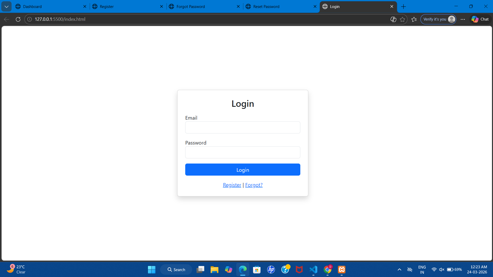
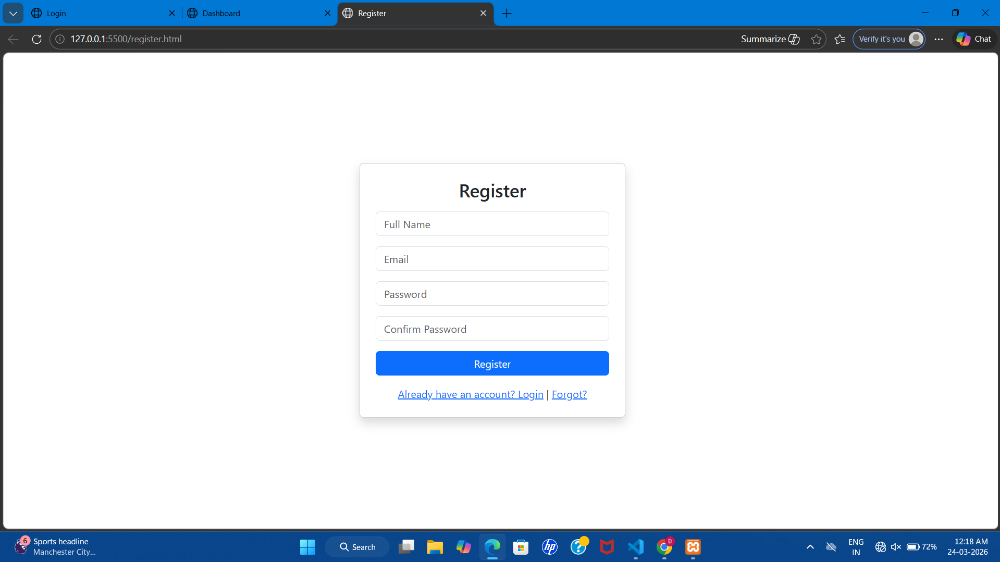
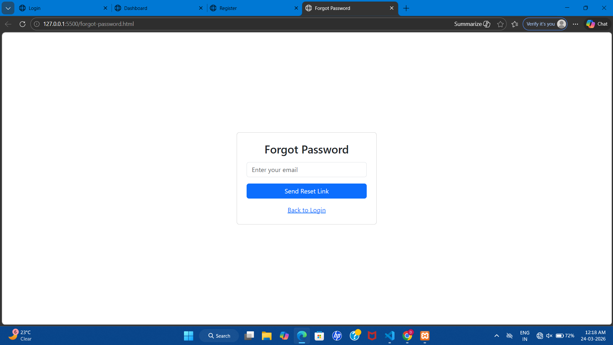
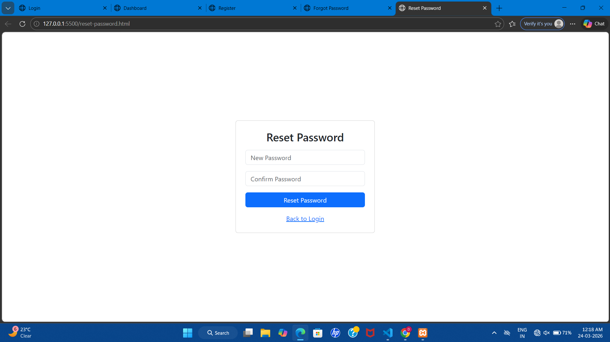
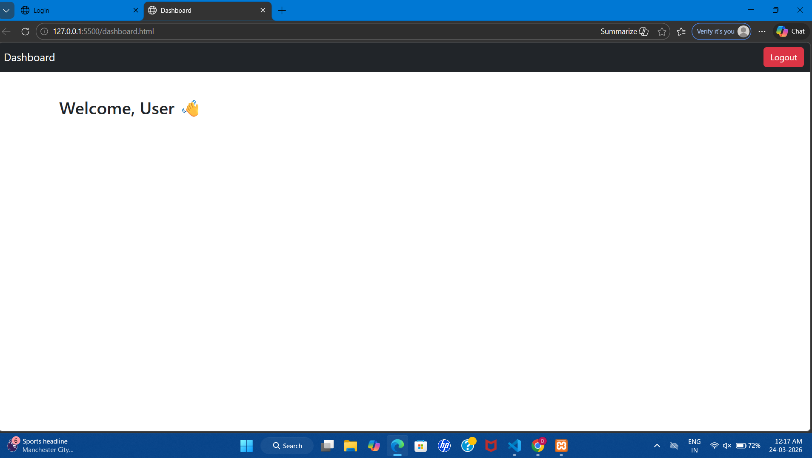

# 🔐 HTML Authentication System POC

This project demonstrates a basic authentication flow using HTML pages and Bootstrap UI.

## 🚀 Features

* Login Page
* Register Page
* Forgot Password Page
* Reset Password Page
* Dashboard Page

## 🛠️ Tech Used

* HTML
* CSS (Custom + Bootstrap 5)
* Bootstrap 5

## 📌 Description

This project demonstrates a basic multi-page authentication system built using HTML and styled with Bootstrap 5.

It includes common authentication flows such as login, registration, password recovery, and a dashboard interface.

> Note: This is a frontend-only project. No backend, database, or real authentication is implemented.

## ▶️ How to Run

1. Download or clone the repository
2. Open the project folder
3. Open `index.html` in any browser

## 📸 Screenshots

### 🔑 Login Page



### 📝 Register Page



### 📧 Forgot Password



### 🔒 Reset Password



### 📊 Dashboard



## 📁 Project Structure

```
index.html
register.html
forgot-password.html
reset-password.html
dashboard.html
styles.css
screenshots/
```
